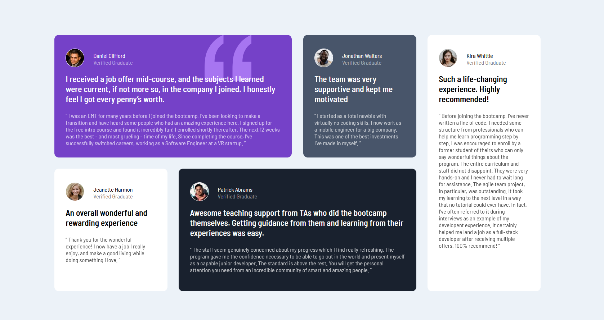

# Frontend Mentor - Testimonials grid section

This is a solution to the [Testimonials grid section challenge on Frontend Mentor](https://www.frontendmentor.io/challenges/testimonials-grid-section-Nnw6J7Un7). 

## The challenge

Users should be able to:

- View the optimal layout for the site depending on their device's screen size

## Screenshot

## Links

-Solution URL: [Solution URL](https://www.frontendmentor.io/solutions/testimonial-using-html-and-css-7yN4CPCJdw)
-Live Site URL: [Live site URL](https://kanakjyoti.github.io/Testimonial-webpage/)

## Built with

- Semantic HTML5 markup
- CSS custom properties
- Flexbox
- CSS Grid
- Mobile-first workflow
